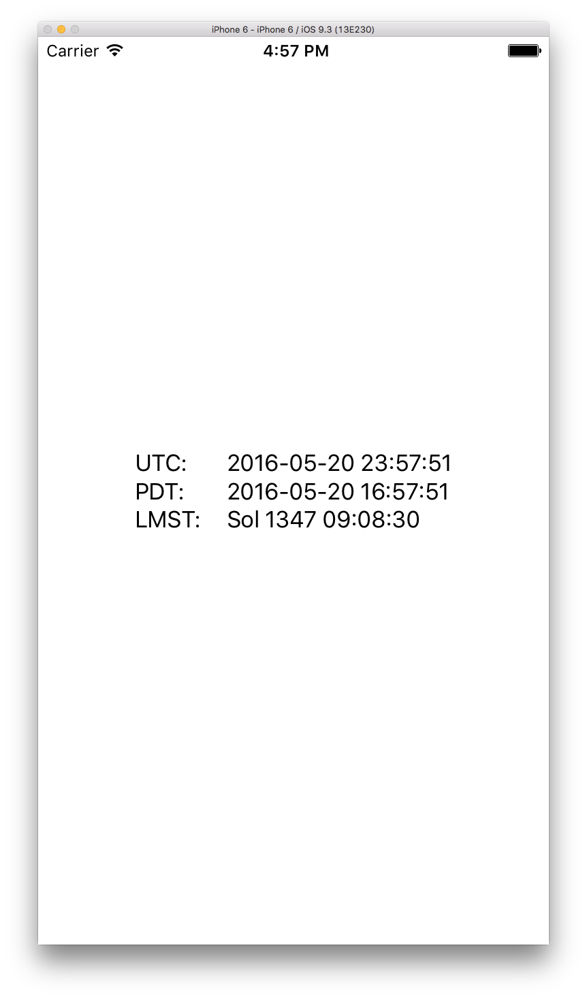

# MarsTimeConversion

[](https://travis-ci.org/Mark Powell/MarsTimeConversion)
[](http://cocoapods.org/pods/MarsTimeConversion)
[](http://cocoapods.org/pods/MarsTimeConversion)
[](http://cocoapods.org/pods/MarsTimeConversion)

## Example

To run the example project, clone the repo, and run `pod install` from the Example directory first.



## Requirements

iOS 9.0 or later

## Installation

MarsTimeConversion is available through [CocoaPods](http://cocoapods.org). To install
it, simply add the following line to your Podfile:

```ruby
pod "MarsTimeConversion"
```

## Author

Mark Powell, drmarkpowell@gmail.com

## License

MarsTimeConversion is available under the Apache 2.0 license. See the LICENSE file for more info.

## Credits

The work of the Mars24 team at NASA Goddard was heavily leveraged to create this library. See [their website] (http://www.giss.nasa.gov/tools/mars24/help/algorithm.html) for documentation and publications on their approach and all the hard work and research that was so thoughtfully communicated for others to use.

